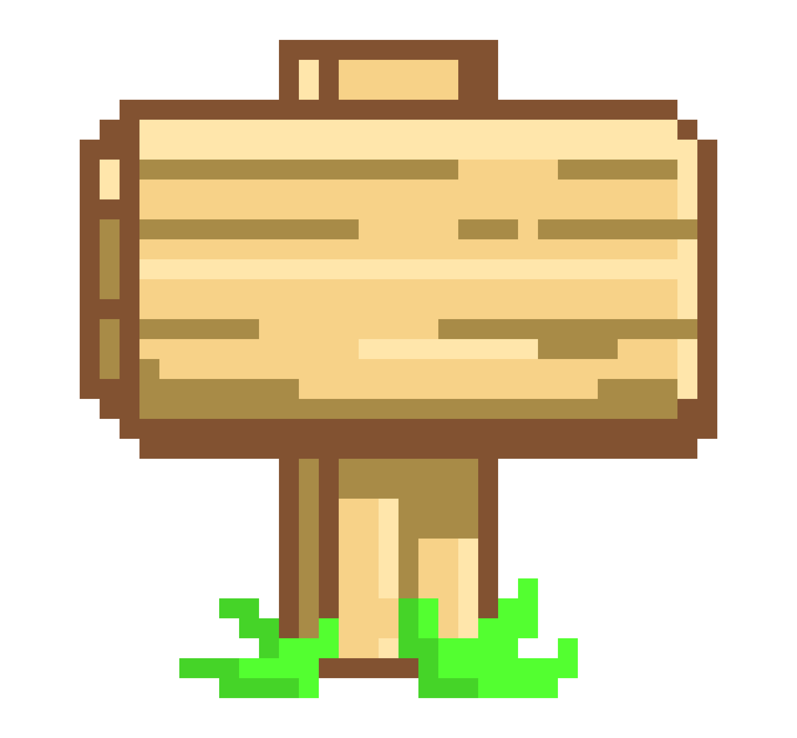

<h1 align="left">
   
  Welcome Traveler 
  
</h1>
<h3 align="left">I'm Adele, a Software Engineer</h3>

- 🖼️ Checkout my website [adelbeit.com](https://adelbeit.com) 

- ✨ I'm passionate about #techforgood.

- 🔭 I’m currently looking for new opporutnities and challenges.

- 🌱 I’m currently learning about **Building a scalable B2B platform**.

<!-- - 👨‍💻 All of my projects are available at [https://adelbeit.com](https://adelbeit.com) -->

- 💬 Ask me about **React, Typescript, UX/UI design, music, television, cooking**.

- 📌 Checkout my latest project **[Event Extractor](https://github.com/adelbeit/event-extractor)**.

<!-- - 📄  Learn about my experiences [https://adelbeit.com/developer](https://adelbeit.com/developer) -->

- ⚡ Fun fact, I've gone solo skydiving.

- ☄ Come hangout with me on [CodePen](https://codepen.io/adelbeit)!

-  I have code if you have coin. 

<h3 align="left">Languages and Tools:</h3>

 

 

 

 

 

 

 

 

 

 

 

 

 

 

 

 

 

 

 

 

 

   

